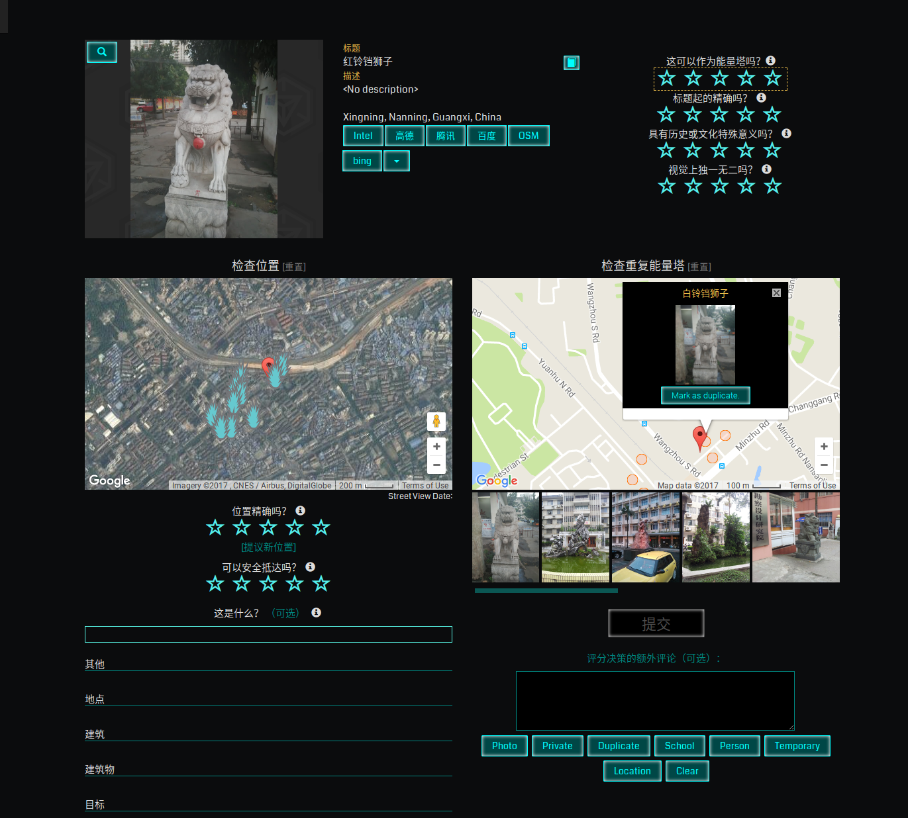

# OPR Tools
Userscript for Ingress Operation Portal Recon - https://opr.ingress.com/recon

Features:
- Additional links to map services like Intel, OpenStreetMap, bing and some german ones
- Disabled annoying automatic page scrolling
- Removed "Your analysis has been recorded." dialog
- Automatically opens the first listed possible duplicate
- Automatically opens the "What is it?" filter text box
- Buttons below the comments box to auto-type common 1-star rejection reasons
- Percent of total reviewed candidates process by Niantic displayed at the bottom of the page
- Add translate buttons for title and description
- 添加了快捷键，数字 1-5 进行评分，空格或回车建确认，ESC 或小键盘上的 / 重置，数字键盘上的 + - 导航切换，也可以用 Tab 和 Shift Tab
- 添加了常用的国内地图，腾讯地图，百度地图和高德地图

Features implemented by [hedger](https://gitlab.com/hedger/opr-tools):
- Moved overall portal rating to same group as other ratings
- Changed portal markers to small circles, inspied by IITC style
- Made "Nearby portals" list and map scrollable with mouse wheel

Download: https://github.com/hubutui/opr-tools-china/raw/master/opr-tools.user.js
